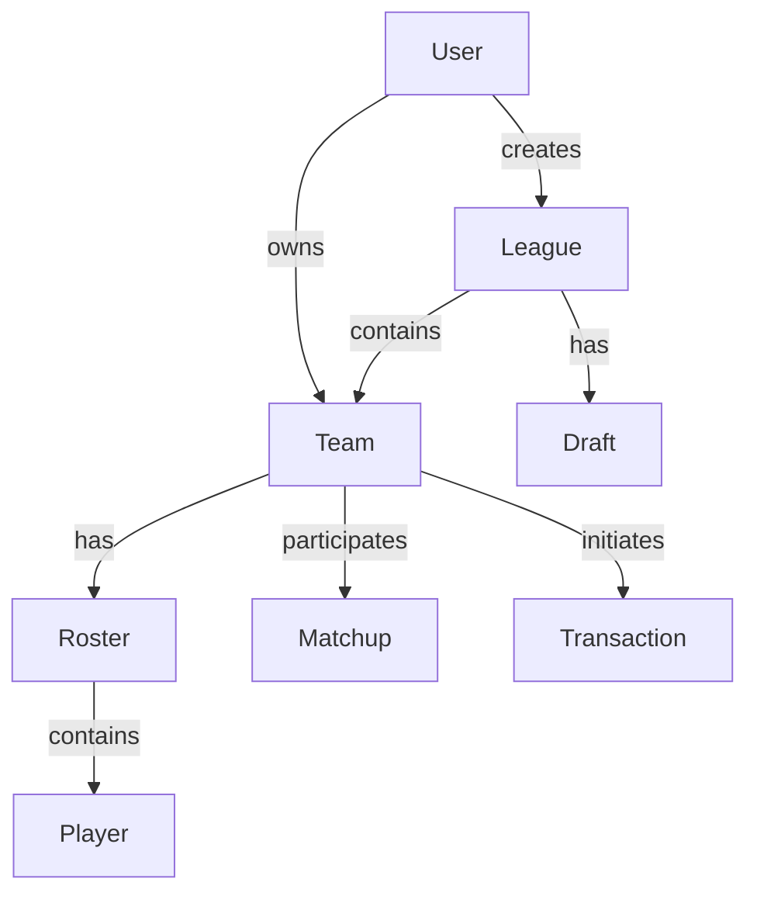

# Astral Draft V4 - Architecture Documentation

## Overview

Astral Draft V4 is a comprehensive fantasy football platform built with modern web technologies, emphasizing performance, scalability, and real-time features.

## Tech Stack

### Core Technologies

- **Framework**: Next.js 14 (App Router)
- **Language**: TypeScript
- **Database**: PostgreSQL with Prisma ORM
- **API Layer**: tRPC for type-safe APIs
- **Authentication**: NextAuth.js
- **Real-time**: Socket.io with Redis pub/sub
- **Caching**: Redis with ioredis
- **Job Queue**: BullMQ
- **State Management**: Zustand
- **Styling**: Tailwind CSS
- **UI Components**: Radix UI primitives

### Infrastructure

- **Deployment**: Vercel/Railway/AWS
- **Database Hosting**: Neon/Supabase/Railway
- **Redis**: Upstash/Railway Redis
- **CDN**: Cloudflare
- **Monitoring**: Sentry/LogRocket

## Architecture Patterns

### 1. API Architecture

```
Client → tRPC Client → tRPC Server → Service Layer → Database
                                   ↓
                              Redis Cache
```

- **tRPC Routers**: Type-safe API endpoints
- **Service Layer**: Business logic abstraction
- **Middleware**: Authentication, rate limiting, logging
- **Caching Strategy**: Redis for frequently accessed data

### 2. Database Schema

#### Core Entities

- **Users**: Authentication and profile management
- **Leagues**: Fantasy football league configuration
- **Teams**: User teams within leagues
- **Players**: NFL player data
- **Drafts**: Draft sessions and picks
- **Rosters**: Team lineups by week
- **Transactions**: Adds, drops, trades, waivers
- **Matchups**: Weekly head-to-head matchups
- **Scoring**: Points calculation and rules

#### Relationships



### 3. Real-time Architecture

```
WebSocket Server
    ├── Draft Rooms
    │   ├── Pick Timer
    │   ├── Auto-pick Logic
    │   └── State Sync
    ├── League Rooms
    │   ├── Chat
    │   ├── Live Scoring
    │   └── Trade Notifications
    └── User Channels
        └── Personal Notifications
```

### 4. Background Jobs

- **Waiver Processing**: Tuesday/Wednesday at 3 AM
- **Stats Updates**: Every 15 minutes during games
- **Score Calculation**: Every 5 minutes on Sundays
- **Trade Expiration**: 48 hours after proposal
- **Notifications**: Immediate and scheduled

## Security

### Authentication & Authorization

- JWT-based sessions
- Role-based access control (RBAC)
- Commissioner privileges
- API rate limiting per endpoint

### Data Protection

- Password hashing with bcrypt
- CSRF protection
- XSS prevention
- SQL injection protection via Prisma
- Input validation with Zod

## Performance Optimizations

### Frontend

- Server-side rendering (SSR) for initial load
- Static generation for marketing pages
- Code splitting per route
- Image optimization with next/image
- Optimistic updates for user actions
- Virtual scrolling for large lists

### Backend

- Database connection pooling
- Query optimization with indexes
- Redis caching for hot data
- Batch processing for bulk operations
- WebSocket connection management
- Horizontal scaling support

## Scalability Considerations

### Database

- Read replicas for heavy queries
- Partitioning by season/league
- Archival strategy for old data
- Efficient indexing strategy

### Caching

- Multi-tier caching (Redis, CDN, browser)
- Cache invalidation strategies
- Distributed caching for multiple servers

### Real-time

- Redis pub/sub for multi-server support
- Connection pooling
- Graceful degradation
- Reconnection strategies

## Monitoring & Observability

### Metrics

- API response times
- Database query performance
- WebSocket connection counts
- Job queue health
- Cache hit rates

### Logging

- Structured logging with correlation IDs
- Error tracking with stack traces
- User action logging
- Performance monitoring

## Development Workflow

### Local Development

```bash
# Install dependencies
npm install

# Setup database
npm run db:migrate

# Start development server
npm run dev

# Start WebSocket server
npm run ws:dev
```

### Testing Strategy

- Unit tests for business logic
- Integration tests for API endpoints
- E2E tests for critical user flows
- Performance testing for high-load scenarios
- Accessibility testing

### Deployment Pipeline

1. Code pushed to GitHub
2. CI/CD runs tests
3. Preview deployment created
4. Manual approval for production
5. Database migrations run
6. Application deployed
7. Health checks verify deployment

## API Design

### tRPC Procedures

- **Public**: No authentication required
- **Protected**: User must be logged in
- **Commissioner**: League commissioner only
- **Admin**: Platform administrators

### Rate Limiting

- Auth endpoints: 5 req/min
- Draft actions: 30 req/min
- Data queries: 200 req/min
- Default: 100 req/min

## Mobile Considerations

- Progressive Web App (PWA) support
- Responsive design (mobile-first)
- Touch-optimized interactions
- Offline capability with service workers
- Push notifications

## Future Enhancements

### Phase 1 (Current)
- Core fantasy football features
- Real-time draft
- Basic scoring and standings
- Trade system

### Phase 2
- Machine learning predictions
- Advanced analytics
- Dynasty/keeper support
- Mobile apps

### Phase 3
- Multi-sport support
- Cryptocurrency integration
- NFT collectibles
- AI-powered insights

## Environment Variables

```env
# Database
DATABASE_URL=

# Redis
REDIS_HOST=
REDIS_PORT=
REDIS_PASSWORD=

# Auth
NEXTAUTH_SECRET=
NEXTAUTH_URL=

# Rate Limiting
UPSTASH_REDIS_REST_URL=
UPSTASH_REDIS_REST_TOKEN=

# External APIs
SPORTS_DATA_API_KEY=
```

## Conclusion

Astral Draft V4's architecture is designed to handle millions of concurrent users during peak times (Sunday game days) while maintaining sub-second response times and real-time features. The modular design allows for easy feature additions and scaling as the platform grows.