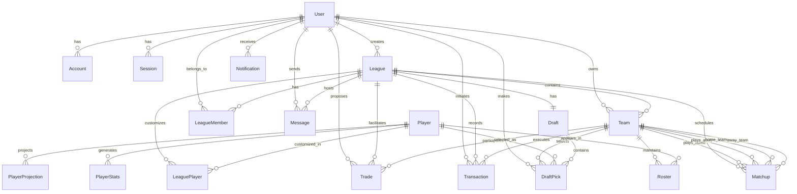

# Database Schema Documentation

## Overview

The Astral Draft V4 database is designed to support a comprehensive fantasy football platform with real-time features, flexible scoring systems, and multiple league types.

## Core Principles

1. **Normalization**: Properly normalized to 3NF where appropriate
2. **Performance**: Strategic denormalization for read-heavy operations
3. **Scalability**: Designed to handle millions of users and transactions
4. **Flexibility**: Supports multiple league types and scoring systems
5. **Auditability**: Timestamps and soft deletes where appropriate

## Entity Relationship Diagram



## Table Definitions

### Users & Authentication

#### `users`
Primary user account table.

| Column | Type | Constraints | Description |
|--------|------|------------|-------------|
| id | VARCHAR | PK | Unique identifier (CUID) |
| username | VARCHAR | UNIQUE, NOT NULL | Display username |
| email | VARCHAR | UNIQUE, NOT NULL | Email address |
| email_verified | TIMESTAMP | | Email verification date |
| password | VARCHAR | NOT NULL | Bcrypt hashed password |
| name | VARCHAR | | Full name |
| bio | TEXT | | User biography |
| avatar | VARCHAR | | Avatar URL |
| role | ENUM | NOT NULL | USER, COMMISSIONER, ADMIN, SUPER_ADMIN |
| status | ENUM | NOT NULL | ACTIVE, SUSPENDED, BANNED, PENDING_VERIFICATION |
| experience_level | VARCHAR | | beginner, intermediate, expert |
| favorite_team | VARCHAR | | NFL team preference |
| settings | JSONB | NOT NULL | User preferences |
| notifications | JSONB | NOT NULL | Notification settings |
| created_at | TIMESTAMP | NOT NULL | Account creation |
| updated_at | TIMESTAMP | NOT NULL | Last update |
| last_login_at | TIMESTAMP | | Last login time |

**Indexes:**
- `idx_users_email` on (email)
- `idx_users_username` on (username)

### League Management

#### `leagues`
Fantasy football leagues.

| Column | Type | Constraints | Description |
|--------|------|------------|-------------|
| id | VARCHAR | PK | Unique identifier |
| name | VARCHAR | NOT NULL | League name |
| slug | VARCHAR | UNIQUE, NOT NULL | URL-friendly identifier |
| description | TEXT | | League description |
| logo | VARCHAR | | League logo URL |
| type | ENUM | NOT NULL | REDRAFT, KEEPER, DYNASTY, BEST_BALL |
| status | ENUM | NOT NULL | DRAFT_SETUP, DRAFTING, IN_SEASON, PLAYOFFS, COMPLETED |
| scoring_type | ENUM | NOT NULL | STANDARD, PPR, HALF_PPR, CUSTOM |
| team_count | INTEGER | NOT NULL | Number of teams (4-20) |
| current_week | INTEGER | NOT NULL | Current week number |
| season | INTEGER | NOT NULL | Year |
| is_public | BOOLEAN | NOT NULL | Public visibility |
| roster_positions | JSONB | NOT NULL | Position requirements |
| max_roster_size | INTEGER | NOT NULL | Maximum roster size |
| scoring_rules | JSONB | NOT NULL | Detailed scoring configuration |
| waiver_type | VARCHAR | NOT NULL | FAAB, Rolling, Reverse |
| waiver_budget | INTEGER | NOT NULL | FAAB budget |
| waiver_period | INTEGER | NOT NULL | Days for waiver period |
| trade_deadline | TIMESTAMP | | Trade deadline date |
| trade_review_days | INTEGER | NOT NULL | Days for trade review |
| trade_votes_needed | INTEGER | | Votes needed to veto |
| playoff_teams | INTEGER | NOT NULL | Number of playoff teams |
| playoff_start_week | INTEGER | NOT NULL | Playoff start week |
| creator_id | VARCHAR | FK | League creator |
| created_at | TIMESTAMP | NOT NULL | Creation date |
| updated_at | TIMESTAMP | NOT NULL | Last update |
| draft_date | TIMESTAMP | | Scheduled draft date |

**Indexes:**
- `idx_leagues_slug` on (slug)
- `idx_leagues_creator` on (creator_id)
- `idx_leagues_season_status` on (season, status)

#### `teams`
Teams within leagues.

| Column | Type | Constraints | Description |
|--------|------|------------|-------------|
| id | VARCHAR | PK | Unique identifier |
| name | VARCHAR | NOT NULL | Team name |
| abbreviation | VARCHAR | NOT NULL | 3-4 letter abbreviation |
| logo | VARCHAR | | Team logo URL |
| motto | VARCHAR | | Team motto |
| wins | INTEGER | NOT NULL | Season wins |
| losses | INTEGER | NOT NULL | Season losses |
| ties | INTEGER | NOT NULL | Season ties |
| points_for | DECIMAL | NOT NULL | Total points scored |
| points_against | DECIMAL | NOT NULL | Total points against |
| standing | INTEGER | NOT NULL | Current standing |
| is_active | BOOLEAN | NOT NULL | Active status |
| eliminated | BOOLEAN | NOT NULL | Playoff elimination |
| owner_id | VARCHAR | FK | Team owner |
| league_id | VARCHAR | FK | Parent league |
| created_at | TIMESTAMP | NOT NULL | Creation date |
| updated_at | TIMESTAMP | NOT NULL | Last update |

**Indexes:**
- `idx_teams_owner` on (owner_id)
- `idx_teams_league` on (league_id)
- `uk_teams_league_owner` UNIQUE on (league_id, owner_id)

### Player Data

#### `players`
NFL player information.

| Column | Type | Constraints | Description |
|--------|------|------------|-------------|
| id | VARCHAR | PK | Unique identifier |
| external_id | VARCHAR | UNIQUE | ESPN/Yahoo/Sleeper ID |
| first_name | VARCHAR | NOT NULL | First name |
| last_name | VARCHAR | NOT NULL | Last name |
| display_name | VARCHAR | NOT NULL | Display name |
| position | ENUM | NOT NULL | QB, RB, WR, TE, K, DEF |
| nfl_team | VARCHAR | NOT NULL | Current NFL team |
| jersey_number | INTEGER | | Jersey number |
| height | VARCHAR | | Height (e.g., "6-2") |
| weight | INTEGER | | Weight in pounds |
| age | INTEGER | | Current age |
| experience | INTEGER | | Years in league |
| college | VARCHAR | | College attended |
| status | ENUM | NOT NULL | ACTIVE, INJURED, IR, OUT, etc. |
| injury_status | VARCHAR | | Current injury status |
| injury_notes | TEXT | | Injury details |
| headshot_url | VARCHAR | | Headshot image URL |
| action_shot_url | VARCHAR | | Action photo URL |
| adp | DECIMAL | | Average Draft Position |
| rank | INTEGER | | Overall rank |
| projected_points | DECIMAL | | Season projection |
| metadata | JSONB | | Additional data |
| created_at | TIMESTAMP | NOT NULL | Creation date |
| updated_at | TIMESTAMP | NOT NULL | Last update |

**Indexes:**
- `idx_players_position_team` on (position, nfl_team)
- `idx_players_name` on (display_name)

#### `player_stats`
Weekly player statistics.

| Column | Type | Constraints | Description |
|--------|------|------------|-------------|
| id | VARCHAR | PK | Unique identifier |
| player_id | VARCHAR | FK | Player reference |
| week | INTEGER | NOT NULL | Week number |
| season | INTEGER | NOT NULL | Season year |
| pass_yards | INTEGER | | Passing yards |
| pass_tds | INTEGER | | Passing touchdowns |
| pass_ints | INTEGER | | Interceptions thrown |
| rush_yards | INTEGER | | Rushing yards |
| rush_tds | INTEGER | | Rushing touchdowns |
| rec_yards | INTEGER | | Receiving yards |
| rec_tds | INTEGER | | Receiving touchdowns |
| receptions | INTEGER | | Receptions |
| fantasy_points | DECIMAL | | Total fantasy points |
| created_at | TIMESTAMP | NOT NULL | Creation date |
| updated_at | TIMESTAMP | NOT NULL | Last update |

**Indexes:**
- `uk_stats_player_week_season` UNIQUE on (player_id, week, season)
- `idx_stats_player_season` on (player_id, season)
- `idx_stats_week_season` on (week, season)

### Draft System

#### `drafts`
Draft sessions.

| Column | Type | Constraints | Description |
|--------|------|------------|-------------|
| id | VARCHAR | PK | Unique identifier |
| league_id | VARCHAR | FK, UNIQUE | Parent league |
| type | ENUM | NOT NULL | SNAKE, AUCTION, LINEAR |
| status | ENUM | NOT NULL | SCHEDULED, IN_PROGRESS, PAUSED, COMPLETED |
| rounds | INTEGER | NOT NULL | Number of rounds |
| time_per_pick | INTEGER | NOT NULL | Seconds per pick |
| scheduled_date | TIMESTAMP | | Scheduled start |
| current_round | INTEGER | NOT NULL | Current round |
| current_pick | INTEGER | NOT NULL | Current pick |
| current_team_id | VARCHAR | FK | Team on clock |
| budget | INTEGER | | Auction budget |
| draft_order | JSONB | NOT NULL | Team order |
| started_at | TIMESTAMP | | Actual start time |
| completed_at | TIMESTAMP | | Completion time |
| created_at | TIMESTAMP | NOT NULL | Creation date |
| updated_at | TIMESTAMP | NOT NULL | Last update |

#### `draft_picks`
Individual draft selections.

| Column | Type | Constraints | Description |
|--------|------|------------|-------------|
| id | VARCHAR | PK | Unique identifier |
| draft_id | VARCHAR | FK | Parent draft |
| team_id | VARCHAR | FK | Selecting team |
| player_id | VARCHAR | FK | Selected player |
| user_id | VARCHAR | FK | User who made pick |
| round | INTEGER | NOT NULL | Round number |
| pick | INTEGER | NOT NULL | Overall pick number |
| amount | INTEGER | | Auction amount |
| is_keeper | BOOLEAN | NOT NULL | Keeper selection |
| keeper_round | INTEGER | | Keeper round cost |
| picked_at | TIMESTAMP | NOT NULL | Selection time |

**Indexes:**
- `uk_picks_draft_round_pick` UNIQUE on (draft_id, round, pick)
- `idx_picks_draft` on (draft_id)
- `idx_picks_team` on (team_id)
- `idx_picks_player` on (player_id)

### Transactions & Trading

#### `transactions`
All roster transactions.

| Column | Type | Constraints | Description |
|--------|------|------------|-------------|
| id | VARCHAR | PK | Unique identifier |
| league_id | VARCHAR | FK | Parent league |
| team_id | VARCHAR | FK | Team making transaction |
| user_id | VARCHAR | FK | User initiating |
| type | ENUM | NOT NULL | ADD, DROP, TRADE, WAIVER_CLAIM |
| status | ENUM | NOT NULL | PENDING, APPROVED, REJECTED, EXECUTED |
| details | JSONB | NOT NULL | Transaction details |
| waiver_priority | INTEGER | | Waiver priority |
| faab_amount | INTEGER | | FAAB bid amount |
| process_date | TIMESTAMP | | Processing date |
| created_at | TIMESTAMP | NOT NULL | Creation date |
| executed_at | TIMESTAMP | | Execution date |

**Indexes:**
- `idx_transactions_league_status` on (league_id, status)
- `idx_transactions_team` on (team_id)
- `idx_transactions_process` on (process_date)

#### `trades`
Trade proposals and history.

| Column | Type | Constraints | Description |
|--------|------|------------|-------------|
| id | VARCHAR | PK | Unique identifier |
| league_id | VARCHAR | FK | Parent league |
| initiator_id | VARCHAR | FK | Initiating team |
| partner_id | VARCHAR | FK | Partner team |
| initiator_user_id | VARCHAR | FK | Initiating user |
| status | ENUM | NOT NULL | PROPOSED, ACCEPTED, REJECTED, VETOED, EXECUTED |
| initiator_gives | JSONB | NOT NULL | Assets given |
| initiator_receives | JSONB | NOT NULL | Assets received |
| veto_votes | INTEGER | NOT NULL | Veto vote count |
| comments | TEXT | | Trade comments |
| proposed_at | TIMESTAMP | NOT NULL | Proposal time |
| responded_at | TIMESTAMP | | Response time |
| executed_at | TIMESTAMP | | Execution time |
| expires_at | TIMESTAMP | NOT NULL | Expiration time |

**Indexes:**
- `idx_trades_league_status` on (league_id, status)
- `idx_trades_initiator` on (initiator_id)
- `idx_trades_partner` on (partner_id)

## Performance Considerations

### Indexing Strategy

1. **Primary Keys**: All tables use VARCHAR with CUID for distributed ID generation
2. **Foreign Keys**: Indexed for join performance
3. **Query Patterns**: Indexes on commonly filtered columns
4. **Composite Indexes**: For multi-column queries
5. **Partial Indexes**: For filtered queries (e.g., active players only)

### Partitioning Strategy

For large-scale deployments:

1. **Partition by Season**: Historical data separation
2. **Partition by League**: Isolate league data
3. **Archive Old Data**: Move completed seasons to cold storage

### Caching Strategy

1. **Player Data**: Cache for 1 hour
2. **League Settings**: Cache for 5 minutes
3. **Live Scores**: Cache for 30 seconds
4. **User Sessions**: Cache for session duration

## Migration Strategy

### Initial Setup

```sql
-- Run migrations
prisma migrate dev

-- Seed initial data
prisma db seed
```

### Production Migrations

1. Test migrations in staging
2. Create backup before migration
3. Run migrations during low-traffic period
4. Verify data integrity
5. Update application code

## Backup & Recovery

### Backup Schedule

- **Full Backup**: Daily at 3 AM
- **Incremental**: Every 4 hours
- **Transaction Logs**: Continuous

### Recovery Procedures

1. Point-in-time recovery available
2. Read replicas for zero-downtime recovery
3. Automated failover for high availability

## Security Considerations

1. **Encryption at Rest**: All sensitive data encrypted
2. **Row-Level Security**: Implemented via application layer
3. **Audit Logging**: All data modifications logged
4. **PII Protection**: Personal data properly secured
5. **GDPR Compliance**: Data retention and deletion policies